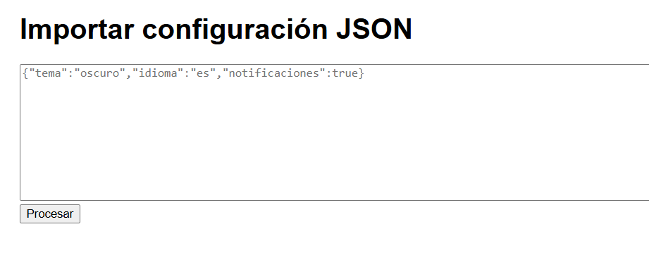

# Reto 53 - Importador de configuración JSON

## 🎯 Objetivo
Parsear JSON de forma segura, validar estructura y normalizar valores por defecto.

## 🛠️ Requisitos
- Navegador web moderno (Chrome, Firefox, Edge).
- [Visual Studio Code](https://code.visualstudio.com/) y Live Server (recomendado para mejor experiencia).

## ▶️ Cómo ejecutar
### 🌐 Opción rápida
1. Abre `index.html` con doble clic (no requiere servidor).
2. También puedes usar Live Server desde VS Code si lo prefieres.
3. Pega un JSON válido (o inválido) en el textarea y pulsa Procesar.

## 🧠 Decisiones y proceso de solución
- Primero parseo con JSON.parse dentro de try/catch.
- Luego valido que el resultado sea un objeto y que tenga las propiedades esperadas.
- Aplico valores por defecto con spread.
- Los mensajes de error diferencian entre sintaxis y estructura.

## ⚠️ Dificultades encontradas
- Al principio no comprobé que el valor fuera un objeto; si se pegaba un array o un número, pasaba sin error pero luego fallaba.
- Tuve que recordar que false es un valor válido y no debe ser reemplazado por defecto; spread lo maneja bien.

## ✅ Pruebas realizadas
- [x] JSON mal formado muestra error de sintaxis.
- [x] JSON con estructura incorrecta (array) muestra mensaje específico.
- [x] Faltan propiedades: se aplican los valores por defecto.
- [x] Tipos incorrectos (ej. tema: 123) muestran error.

## 📸 Evidencia
*Reemplaza esta línea con la captura de pantalla después de ejecutar.*  
Navegador mostrando configuración normalizada con colores.

---

> **Nota:** Este reto forma parte del manual de JavaScript 2026. Desarrollado siguiendo los criterios de aceptación.
