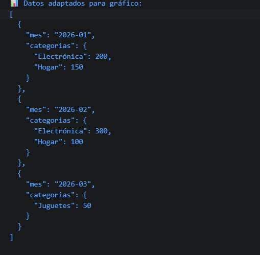

# Reto 54 - Adaptador de datos para gráficos

## 🎯 Objetivo
Transformar un conjunto de transacciones a totales por mes y categoría usando map, filter y reduce.

## 🛠️ Requisitos
- [Node.js](https://nodejs.org) instalado (versión LTS recomendada).
- Terminal de comandos (Git Bash, CMD, PowerShell, Bash).

## ▶️ Cómo ejecutar
### 💻 Ejecución con Node.js
1. Abre una terminal en la raíz del repositorio.
2. Ejecuta: `cd bloque-7/Reto\ 54 && node Reto54.js`
3. Observa los datos agrupados en consola.

## 🧠 Decisiones y proceso de solución
- Filtré registros inválidos (categoría ausente o valor no positivo) sin mutar el original.
- Normalicé las fechas extrayendo solo el mes para agrupar.
- Usé reduce con un acumulador anidado (mes -> categoría -> total).
- Ordené los meses con sort y luego convertí a array.

## ⚠️ Dificultades encontradas
- Al principio usé un acumulador vacío en reduce sin inicializar; eso provocó errores. Agregué {} como valor inicial.
- Tuve que recordar que sort con strings localCompare es más fiable que restar.
- Los registros con categoría null me obligaron a validar el tipo.

## ✅ Pruebas realizadas
- [x] Los registros inválidos no aparecen en el resultado.
- [x] Los totales suman correctamente por categoría.
- [x] Los meses están ordenados cronológicamente.
- [x] El resultado es JSON serializable.

## 📸 Evidencia
*Reemplaza esta línea con la captura de pantalla después de ejecutar.*  
Terminal mostrando el JSON con datos agrupados.

---

> **Nota:** Este reto forma parte del manual de JavaScript 2026. Desarrollado siguiendo los criterios de aceptación.
