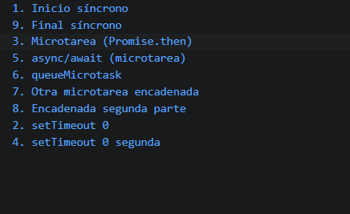

# Reto 55 - Predicción del orden de ejecución

## 🎯 Objetivo
Experimentar con el event loop para predecir el orden de logs síncronos, microtareas y temporizadores.

## 🛠️ Requisitos
- [Node.js](https://nodejs.org) instalado (versión LTS recomendada).
- Terminal de comandos (Git Bash, CMD, PowerShell, Bash).

## ▶️ Cómo ejecutar
### 💻 Ejecución con Node.js
1. Abre una terminal en la raíz del repositorio.
2. Ejecuta: `cd bloque-7/Reto\ 55 && node Reto55.js`
3. Compara tu predicción con el orden real.

## 🧠 Decisiones y proceso de solución
- Antes de ejecutar, escribí mi predicción en comentarios.
- Incluí varios tipos de tareas asíncronas: setTimeout(0), Promise.resolve().then, async/await, queueMicrotask.
- Después de ejecutar, documenté el orden real y lo comparé.

## ⚠️ Dificultades encontradas
- Pensé que los temporizadores se ejecutaban justo después del código síncrono, pero las microtareas tienen prioridad.
- Entender que await pausa la función async pero no detiene el event loop fue clave.
- queueMicrotask y .then tienen el mismo nivel de prioridad, se ejecutan en orden.

## ✅ Pruebas realizadas
- [x] El código síncrono se completa primero.
- [x] Todas las microtareas se ejecutan antes que cualquier temporizador.
- [x] El orden de microtareas es FIFO.
- [x] La predicción inicial falló, pero aprendí de la comparación.

## 📸 Evidencia
*Reemplaza esta línea con la captura de pantalla después de ejecutar.*  
Terminal con los logs en orden y comentarios explicativos.

---

> **Nota:** Este reto forma parte del manual de JavaScript 2026. Desarrollado siguiendo los criterios de aceptación.
