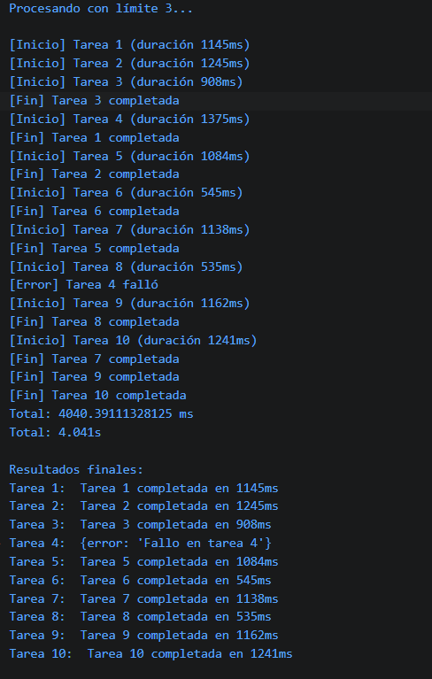

# Reto 56 - Cola de descargas limitada

## 🎯 Objetivo
Implementar un limitador de concurrencia que ejecute un máximo de N tareas simultáneas con promesas.

## 🛠️ Requisitos
- [Node.js](https://nodejs.org) instalado (versión LTS recomendada).
- Terminal de comandos (Git Bash, CMD, PowerShell, Bash).

## ▶️ Cómo ejecutar
### 💻 Ejecución con Node.js
1. Abre una terminal en la raíz del repositorio.
2. Ejecuta: `cd bloque-7/Reto\ 56 && node Reto56.js`
3. Observa que solo 3 tareas se ejecutan a la vez (verás logs de inicio intercalados).

## 🧠 Decisiones y proceso de solución
- Diseñé una función ejecutarConLimite que recibe un array de funciones que devuelven promesas.
- Llevo un contador de tareas activas (enEjecucion) que impide lanzar más del límite permitido.
- Los resultados se guardan en el mismo orden de la entrada, independientemente del orden de finalización.
- Las tareas que fallan se registran como objeto {error} para no perder información.
- Agregué logs de inicio/fin para que sea visible el control de concurrencia.

## ⚠️ Dificultades encontradas
- La primera versión no limitaba realmente: usaba un while que lanzaba todo de golpe. Tuve que añadir un contador de tareas activas.
- Controlar que iniciarSiguiente no se llamara infinitas veces fue delicado; puse una condición de salida clara cuando completadas === tareas.length.
- Los logs de inicio/fin me ayudaron a depurar visualmente cuántas tareas estaban activas en cada momento.

## ✅ Pruebas realizadas
- [x] Nunca hay más de 3 tareas activas (se ve en los logs de inicio).
- [x] Los resultados mantienen el orden original.
- [x] La tarea 4 falla y se registra como error sin detener el proceso.
- [x] El proceso termina y muestra el tiempo total.

## 📸 Evidencia
*Reemplaza esta línea con la captura de pantalla después de ejecutar.*  
Terminal con los logs de inicio/fin y resultados en orden.

---

> **Nota:** Este reto forma parte del manual de JavaScript 2026. Desarrollado siguiendo los criterios de aceptación.
